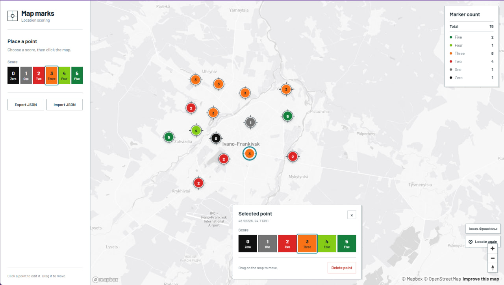

# Map marks

A small SPA for placing and scoring markers on an interactive Mapbox map.



## Features

- Add markers by clicking the map.
- Assign scores from `0` to `5` with distinct colors.
- Edit, drag, and delete existing markers.
- View live totals for every score.
- Locate the user's city with permission.
- Scale marker details with the map zoom.
- Import and export markers as JSON.
- Simulate API failures with an independent 30% chance.

## Stack

- **Frontend:** React, TypeScript, Mapbox GL JS
- **Backend:** FastAPI, Python
- **Tests:** Vitest, pytest

## Setup

Backend — Python 3.10+:

```powershell
cd backend
py -m venv .venv
.venv\Scripts\python -m pip install -r requirements.txt
```

Frontend — Node.js 20+:

```powershell
cd frontend
Copy-Item .env.example .env
# Add your Mapbox public token to .env
npm install
```

## Run

Windows:

```powershell
.\start.cmd
```

Bash:

```bash
bash ./start.sh
```

The app opens at <http://localhost:5173>.

## Checks

```powershell
cd frontend
npm run check

cd ../backend
.venv\Scripts\python -m pytest
```
